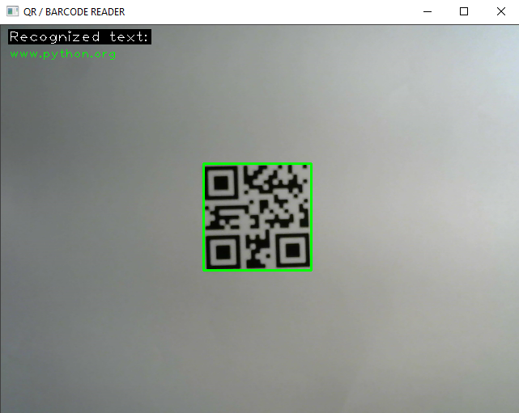
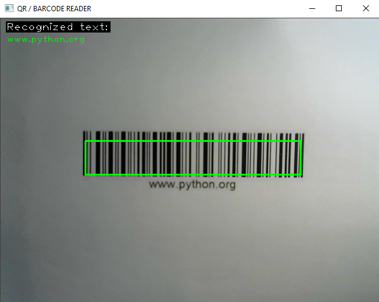

# Simple QR / Barcode reader
A simple live QR / Barcode reader implemented using Python, opencv2 and pyzbar.

## How to run
1. Either fork or download the repository
2. Install opencv2 and pyzbar dependencies using `npm i` command
3. Run the program

## How does it work
1. Opens camera and calls main loop function
2. For each frame decode the image using pyzbar
3. If a barcode or a QR code is detected put a green rectangle around it and displays decoded text

## Examples
Below you can find some examples.
- **QR Code on a piece of paper**

- **Barcode on a piece of paper**

